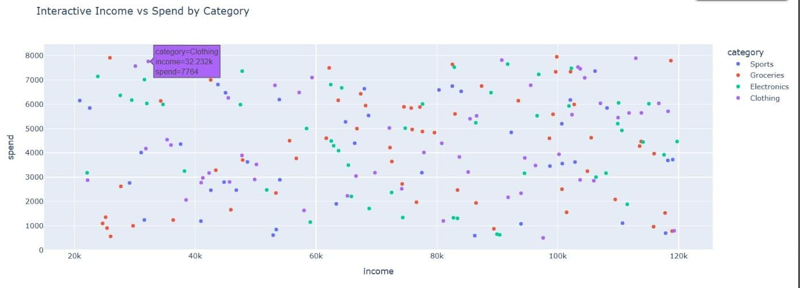

# 📊 Exploratory Visualization Project

## 📌 Overview
This project is based on exploratory data analysis (EDA) using a synthetic retail dataset. The main goal is to understand customer behavior by visualizing different patterns and relationships in the data.

## 🛠️ Tools Used
- Python 🐍
- Pandas 📊
- NumPy 🔢
- Matplotlib 📉
- Seaborn 🎨
- Plotly 🌐

## 📂 Dataset
The dataset is generated using NumPy random functions. It includes:
- Age of customers 👤
- Income 💰
- Spending amount 🛒
- Product category 🏷️

## 📋 Tasks Performed

### 📊 Task 1: Bar Chart
Calculated the average spending for each category and visualized it using a bar chart with Matplotlib. This helps to easily compare spending across categories.

### 📈 Task 2: Scatter Plot
Plotted income vs spending using Seaborn to check if there is any relationship between how much a customer earns and how much they spend.

### 🌐 Task 3: Interactive Plot
Created an interactive scatter plot using Plotly. This allows better understanding by hovering over points and exploring category-wise data.

## 📸 Interactive Plot Preview

## 🔍 Key Observations
- Some categories have higher average spending than others 📊  
- Income and spending show a slight relationship 📈  
- Interactive plots provide more detailed insights than static plots 🌐  

## ✅ Conclusion
This project helped in understanding how to choose the right type of visualization and interpret data effectively in a simple and clear way.

## 📤 Submission
The notebook is created in Google Colab with all outputs visible as required.

---

## ⚠️ Note: 
Plotly interactive graph may not display on GitHub. Please view it in Google Colab for full interactivity.

---

### ✍️ Submitted by  
**Keshav Kaushik**  
B.Sc Computer Science (IInd Year)
